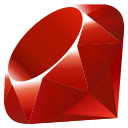
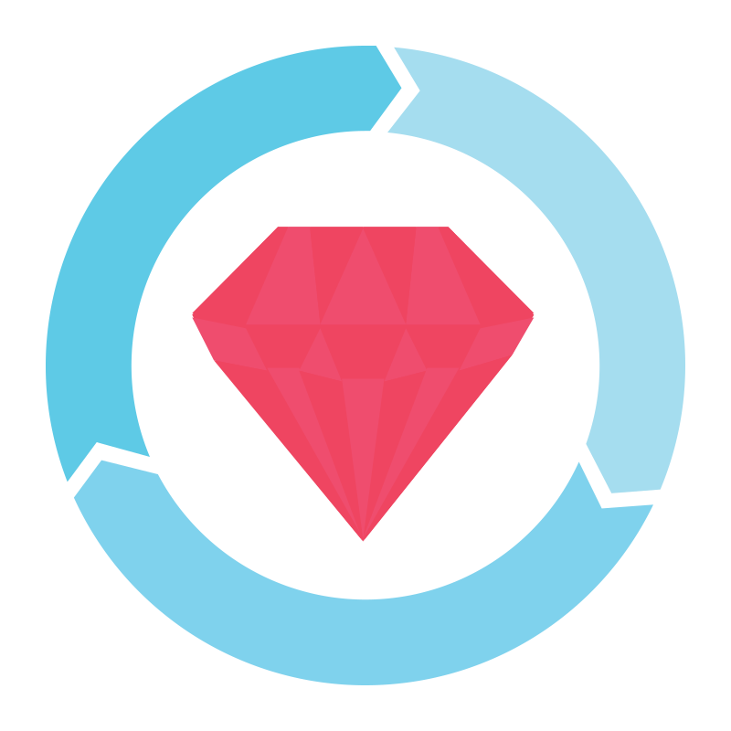
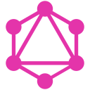

<h1 align="center">Welcome! </h1>
<h3 align="center">Fullstack Engineer | Building Scalable, Product-Focused Platforms for Global Teams</h3>

  
  

<fieldset style="border: 2px solid red; border-radius: 10px; padding: 20px; max-width: 800px;">
  <legend align="left"><h3>About me</h3></legend>

  <em>
I am a Fullstack Engineer focused on building scalable, high-performance, and product-driven web applications, with strong expertise in Ruby on Rails and modern frontend technologies.
 
I have advanced experience in Ruby on Rails, React, and PostgreSQL, working in complex, high-scale systems with microservices architecture and cloud-native infrastructure. My work spans backend engineering, frontend development, and system design in distributed environments.
  </em> 
   

   <b><i>Stack</i></b> 

 
  

<b>Backend</b>  
<table border="0" cellspacing="0" cellpadding="12">
<tr>
<td align="center"> Ruby</td>
<td align="center"> Rails</td>
<td align="center"> Node.js</td>
<td align="center"> Sidekiq</td>
<td align="center"> RSpec</td>
<td align="center"> RuboCop</td>
<td align="center"> Jest</td>
</tr>
</table>

 

<b>Frontend</b>  
<table border="0" cellspacing="0" cellpadding="12">
<tr>
<td align="center"> Vite</td>
<td align="center"> React</td>
<td align="center"> Next.js</td>
<td align="center"> TypeScript</td>
<td align="center"> JavaScript</td>
<td align="center"> Tailwind CSS</td>
<td align="center"> Sass</td>
</tr>
</table>

 

<b>Database &amp; API</b>  
<table border="0" cellspacing="0" cellpadding="12">
<tr>
<td align="center"> PostgreSQL</td>
<td align="center"> MySQL</td>
<td align="center"> GraphQL</td>
</tr>
</table>

 

<b>DevOps &amp; CI/CD</b>  
<table border="0" cellspacing="0" cellpadding="12">
<tr>
<td align="center"> AWS</td>
<td align="center"> GitLab</td>
<td align="center"> GitHub Actions</td>
<td align="center"> Docker</td>
<td align="center"> Linux</td>
<td align="center"> Git</td>
</tr>
</table>

 

<b>Markup &amp; Styling</b>  
<table border="0" cellspacing="0" cellpadding="12">
<tr>
<td align="center"> HTML5</td>
<td align="center"> CSS3</td>
<td align="center"> Bootstrap</td>
</tr>
</table>

 
 

- 📫 Contact: **gustavoslomski@gmail.com**

 